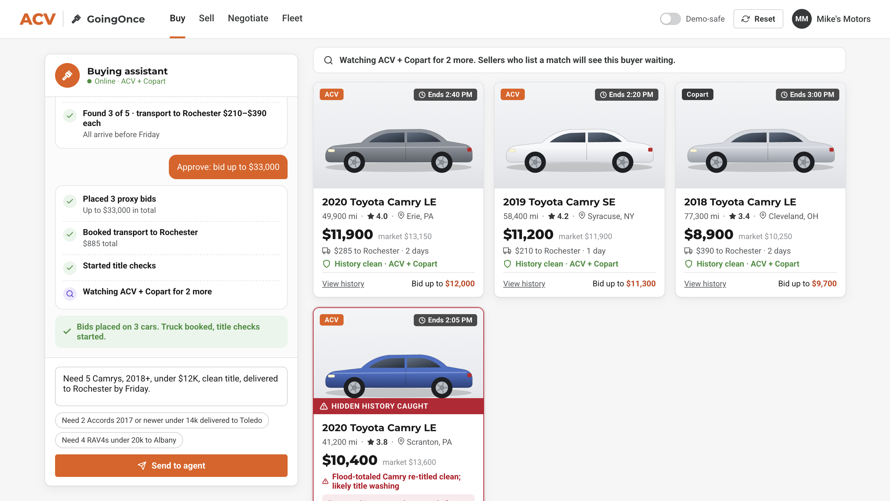
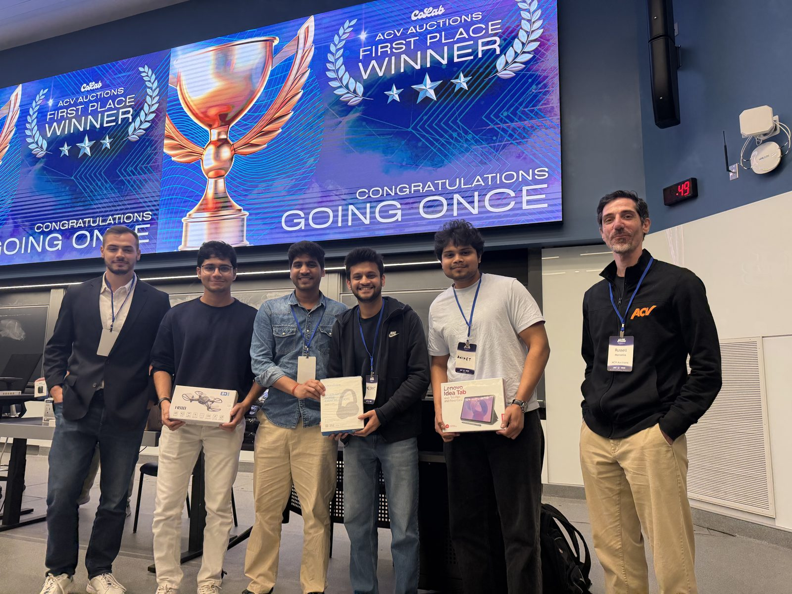
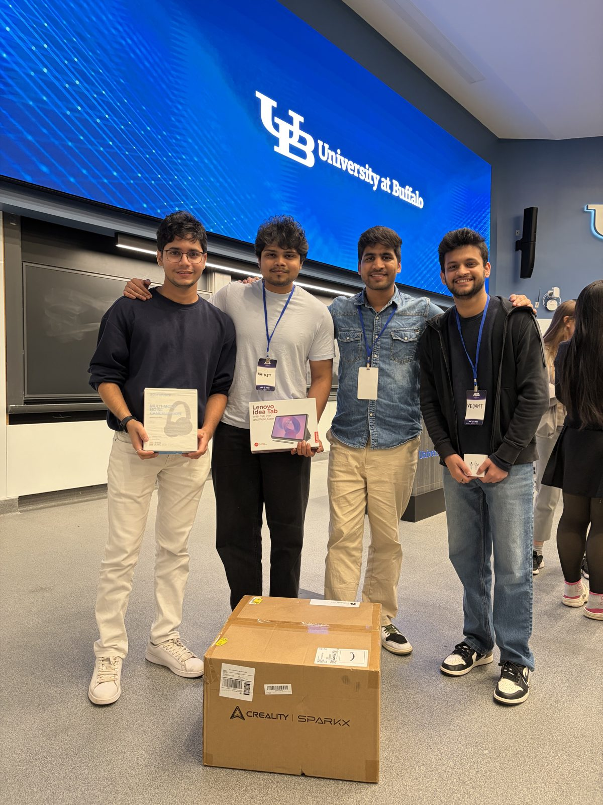
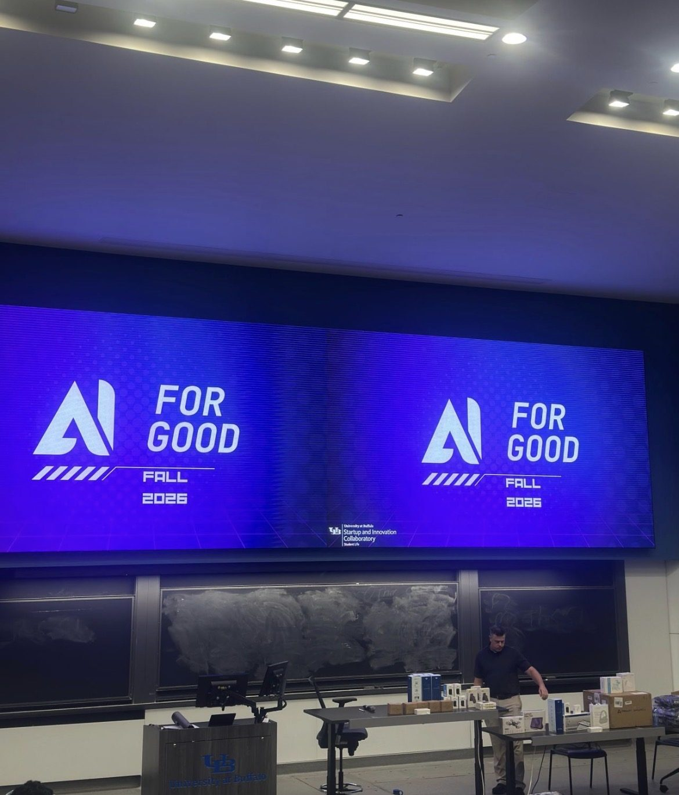

# GoingOnce

**Every car finds its best buyer, across ACV and Copart.**

🏆 **1st place** in the **ACV Auctions + Copart** challenge at the **AI for Good Hackathon Design Challenge** (University at Buffalo, October 2026).



Four AI agents built with **LangGraph** and **Claude Opus 5.5**, one tab each:

| Tab | What the agent does |
|---|---|
| 🛒 **Buy** | A dealer says what they need in plain words. The agent searches ACV + Copart, checks each car's history, throws out cars with hidden damage, and **asks before bidding**. It keeps watching for anything it couldn't find. |
| 📸 **Sell** | Photos in. AI writes the condition report, shows where the seller keeps the most money, and finds **buyers already waiting**. One tap lists it. No sale → re-offered to Copart's global buyers. |
| 🤝 **Negotiate** | Seller asks $15,000, top bid is $12,000. Each side's agent keeps a private limit; a mediator closes the gap in rounds, then the deal **closes itself**: escrow payment, insurance, loan payoff, title, truck. |
| 🚚 **Fleet** | A rental fleet sells 120 similar cars. The agent spreads them across markets in **full truckloads**, so prices hold and transport stays low. |

## 🏆 Winning team

GoingOnce won **1st place** in the ACV Auctions challenge at **AI for Good, Fall 2026**, hosted by the University at Buffalo's Startup and Innovation Collaboratory.

**Team:** Raunak Kumar Pandey, Vedant Shinde, Aniket Khade, Jay Pathare



<p align="center">
  
  
</p>

---

## Run it

```bash
cd ~/Desktop/hackathon2026/goingonce
.venv/bin/streamlit run app.py
```

Open http://localhost:8501. The sidebar is hidden; click **»** (top left) to open it:
- **Demo-safe mode:** uses saved AI results. Turn on if the Wi-Fi is bad.
- **↺ Reset demo:** press before presenting.

First-time setup on another machine: `python3 -m venv .venv && .venv/bin/pip install -r requirements.txt`, then `cp .env.example .env` and paste the API key. Never commit `.env`.

### ACV-style frontend (React)

An alternate UI that looks like a tool inside an ACV-style marketplace: a GoingOnce assistant panel on the left, marketplace results (vehicle cards with car images) on the right.

```bash
./run_acv.sh            # builds the React app and serves it + the agent API on http://localhost:8000
```

For frontend development: `.venv/bin/uvicorn api:app --port 8000` in one terminal, `cd acv-frontend && npm run dev` in another (http://localhost:5173, `/api` is proxied).

---

## What's real and what's simulated

| Real | Simulated |
|---|---|
| Claude reads requests (any language), car photos, and writes the explanations | 310 ACV + Copart listings and their histories (generated) |
| Four LangGraph agents with human approval steps, loops, and shared memory | Bids, payments, insurance, trucks and messages (saved locally, nothing is sent) |
| History checks: hidden salvage and odometer rollback | Prices, ACV fees, market demand and truck costs (simple, illustrative formulas) |

In production, the same tools would call ACV and Copart's inventory, inspection and title systems.

---

## How it's built

```
app.py                      Streamlit UI (4 tabs)
api.py                      HTTP API for the React UI (streams agent steps as Server-Sent Events)
acv-frontend/               ACV-style React UI (Vite): assistant panel + marketplace cards
carcompass/
  agents/buyer.py           Buy agent (pauses for approval before bidding)
  agents/seller.py          Sell agent (pauses for "List now" and the auction result)
  agents/deal.py            Negotiate agent (negotiation loop, backhaul bridge, automated closing)
  agents/fleet.py           Fleet agent (demand check, truckload plan, scheduling)
  llm.py                    Claude calls, each with a saved fallback
  tools.py                  Search, history checks, transport, pricing, matching
  negotiation.py            Offer curves, comparable sales, fees, closing plan
  fleet.py                  Fleet generator, market demand, distribution planner
  store.py                  Shared memory: saved requests, listings, bids, messages
  data/catalog.py           Generated marketplace + hand-placed demo cars
docs/graphs/                Agent diagrams (PNG) for slides
docs/screenshots/           App screenshots for slides
tests/                      24 tests, including a click-through of every tab and the API
```

- Claude is used for language and photos only; search, history checks, prices, negotiation math and logistics are plain code, so results repeat.
- Model: `claude-opus-5-5` (change with `CARCOMPASS_MODEL` in `.env`). If a Claude call fails, that step uses its saved result.

```bash
.venv/bin/python -m pytest -q        # all tests
```


## Troubleshooting
- **iPhone photos won't upload:** HEIC isn't supported. Use JPG or a screenshot.
- **AI slow:** turn on Demo-safe mode.
- **Port in use:** `.venv/bin/streamlit run app.py --server.port 8502`
